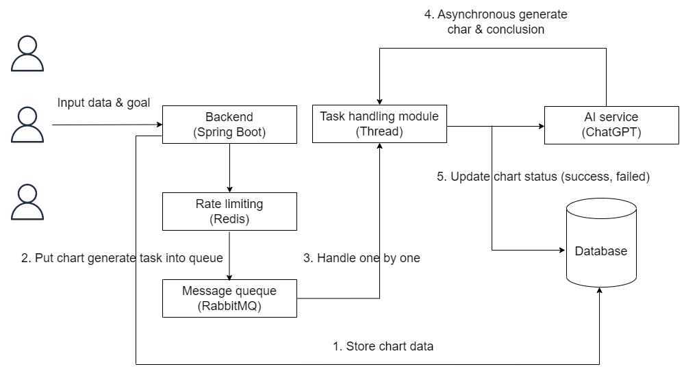
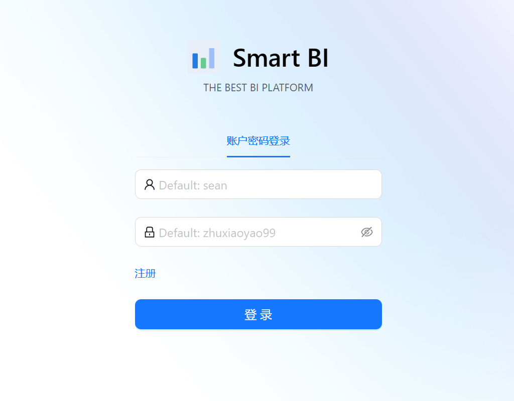
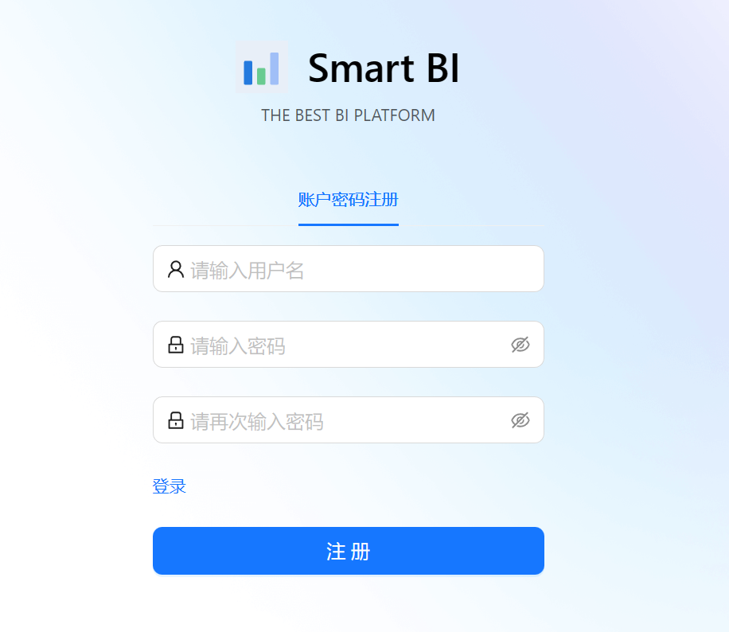
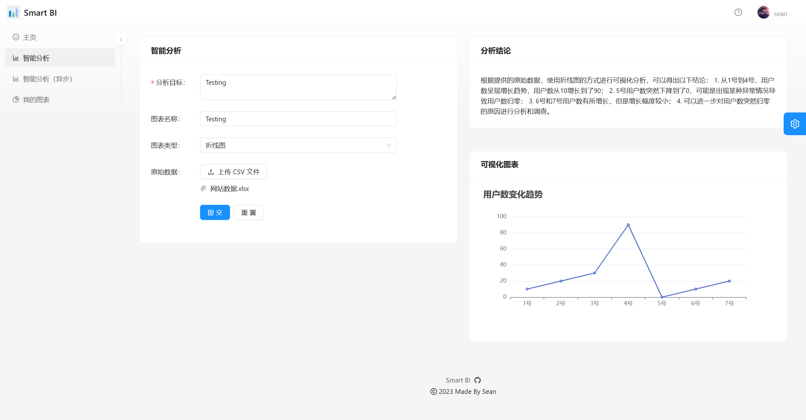
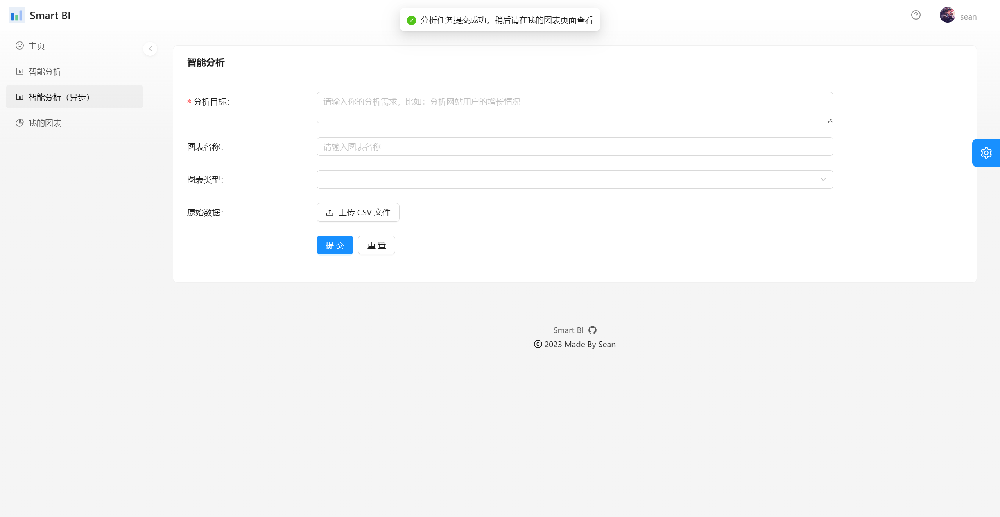
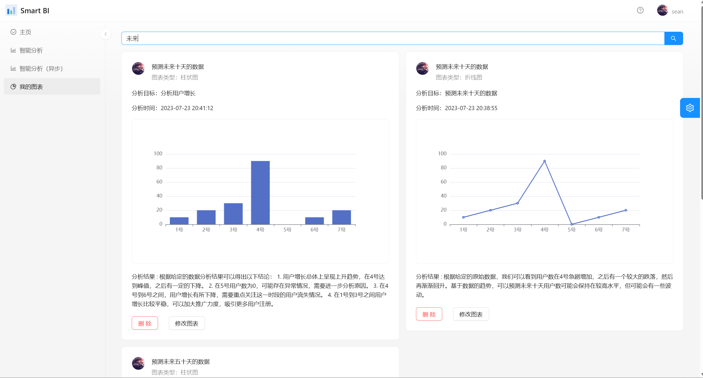
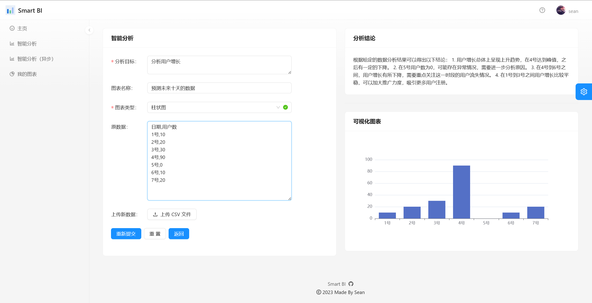

# SMART BI Platform 📊

> An automatic analysis platform based on AI, which only requires data and requirement to generate the conclusion
>
> An intelligent data analysis platform based on **React + Spring Boot + Redis + RabbitMQ + MyBatis Plus + AIGC**. Unlike traditional BI, data analysts only need to import the original data set and enter the objectives they want to analyze. AI automatically generate a chart that meets the requirements as well as the conclusions of the analysis. In addition, there will be chart management, asynchronous generation and other functions, significantly reducing the cost of manual data analysis
>
> **Pros:**  It allows users who don't know how to analyze data to quickly complete data analysis by inputting the goal, which greatly saves labor costs, and the AI interface will be used to generate the analysis results
>
> A full-stack project where has been deployed on-line. The project will continue to expand and optimize in the future!
>
> Address: [SMART BI Platform](http://smartbi.eu-west-1.elasticbeanstalk.com/)


## System Architecture ⭐
### Basic  Architecture
The client side enters the analysis demand and raw data and sends a request to the business back-end. The business back-end utilizes the AI service to process the client data, remain to the database, and generate charts. The processed data is sent from the business back-end to the AI service, which generates the results and returns them to the back-end, and ultimately returns the results to the client for demonstration


### Optimized Architecture - Asynchronization
Asynchronization: 

Since invoking AI consumes a long operation time, asynchronization allows the user to submit without waiting and will be notified when the operation is successful

Business process:

1: User clicks on the Submit button on the Intelligent Analytics page, the chart is immediately saved to the database (as a task)

2: Users can view the information and status of all charts (generated, in progress, failed) on the chart management page

3: Users can modify the information of failed charts by clicking Re-generate





## Tech Stack 🔥

### Frontend
- Framework：React、Umi
- Component：Ant Designts
- Extension：TypeScript、Less
- Package：Webpack
- Code specification：ESLint、StyleLint、Prettier
- Chart：ECharts 


### Backend

- Language：Java

- Framework：SpringBoot 2.7.2、Mybatis-plus

- Database：MySQL8、Redis

- Rate limiter：Redissson

- Message queue：RabbitMQ

- AI：AI SDK

- Asynchronization：JDK ThreadPool

- Data processing：Easy Excel

- Specification：Swagger，Knife4j

  


## Functional module  🎊

> 🌟 Core function
>
> 🚀 To do

- Login / Register / Logout
- Synchronized chart generation
- 🌟Asynchronous Chart Generation
- View / search chart result 
- View chart detail & re-generate
- Download test data（🚀）


## Project display  📊
- User Login / Registration






- Synchronized chart generation




- Asynchronous Chart Generation




- View / search chart result 




- View chart detail & re-generate




## Quick start 🏃‍♂️

### Backend

Configuration of MySQL 8.0 、Redis 、RabbitMQ 3.12.2 and corresponding ports


### Frontend

Environment：Node.js >= 18

Dependency：

```
npm i @ant-design/pro-cli -g
npm i
```


Start：

```
npm run start:dev
```


## Contribution 👨‍👨‍👦‍👦

Looking forward to more contributions ：

- I will respond positively to bugs and suggestions in the Issues section.

